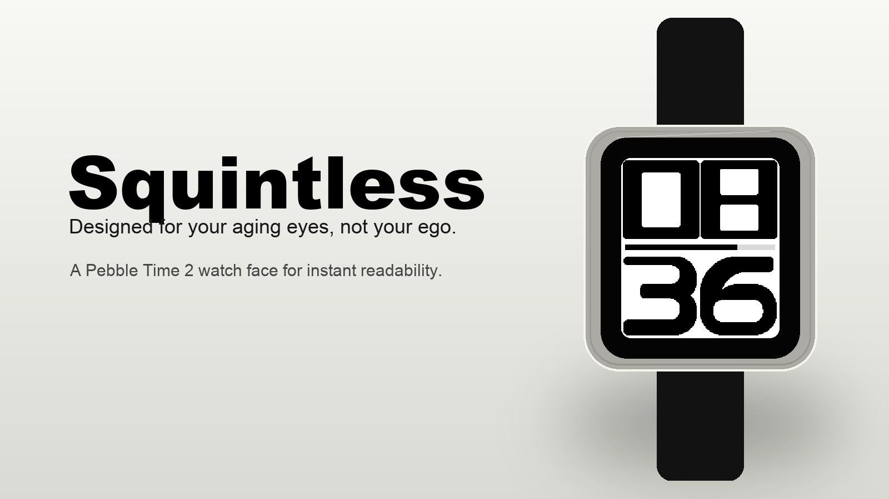
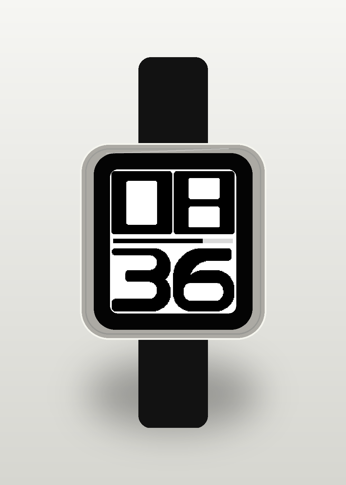
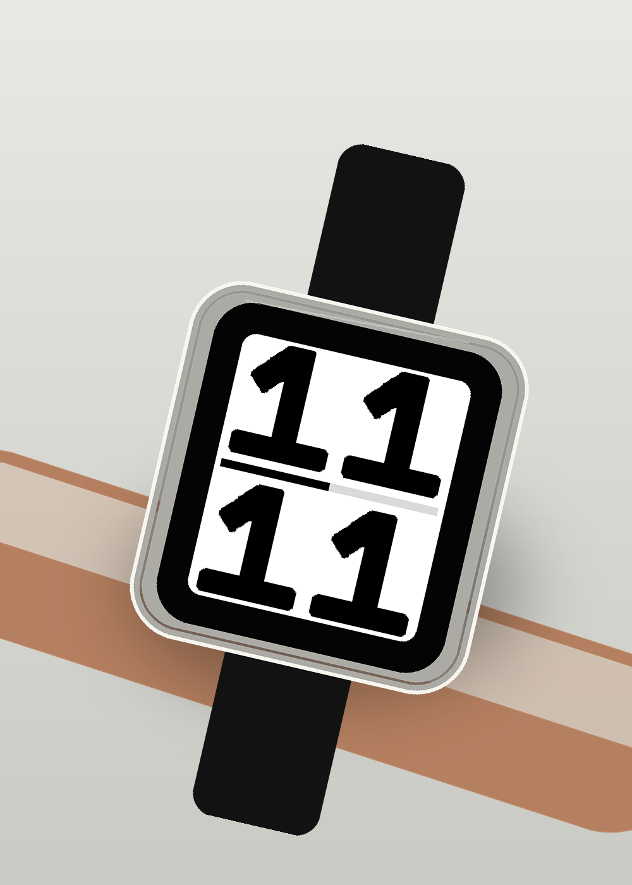
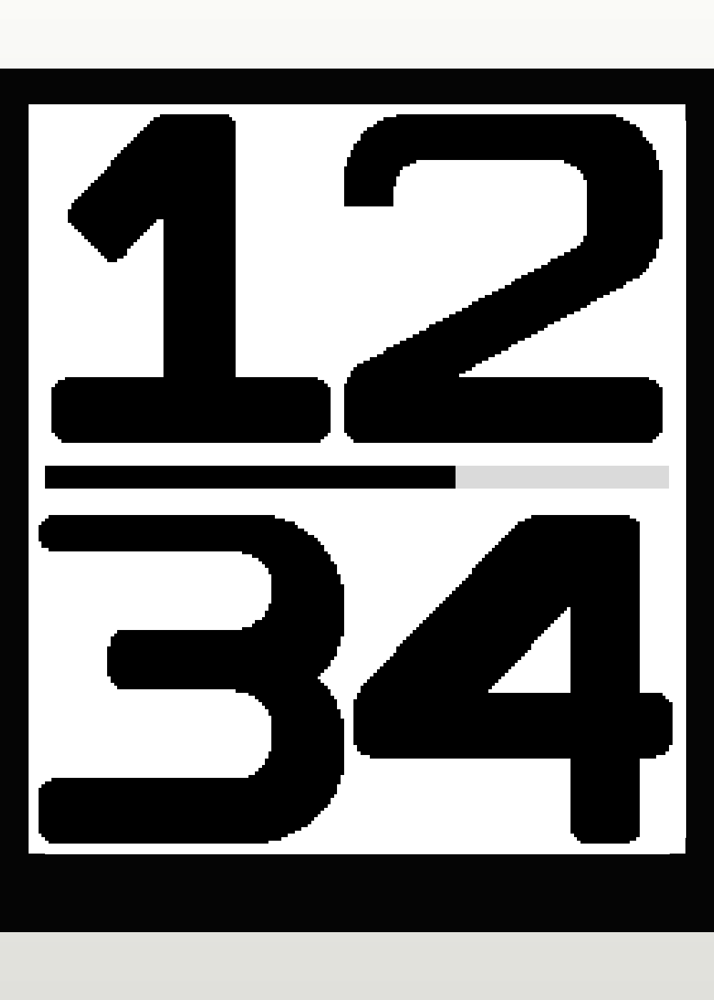
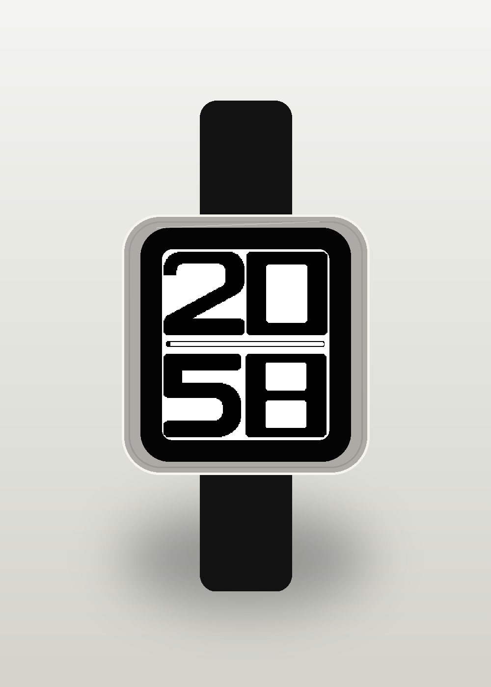
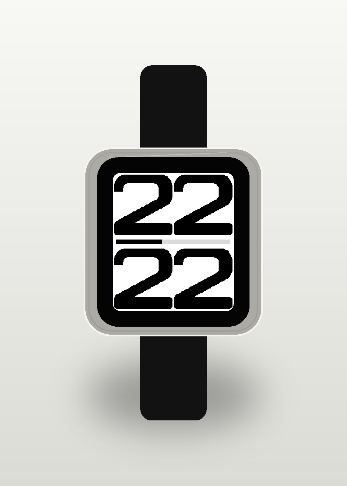

# Squintless

Designed for your aging eyes, not your ego.



Squintless is an accessibility-first watch face for Pebble Time 2. It exists for one job: let you tell the time instantly.

By default: no visible date, no weather, no step count, no seconds, no icons, and no decorative complications.

Every pixel is there to improve readability.

## Philosophy

Most watch faces try to prove how much information they can fit on a tiny screen. Squintless goes the other way.

The top half is hours. The bottom half is minutes. The middle is a quiet battery indicator. The result is a watch face you can read with a quick glance, even when your near vision is not cooperating.

When you want the date, press the middle button. Squintless temporarily replaces the time with a large month/day date for three seconds, then returns to the default face.

Squintless is built for people over 40, people whose close-up vision has changed, and anyone who values function over decoration.

It is not a retro watch face. It is not a minimalist art project. It is a purpose-built accessibility product.

## Screenshots







## Layout

Squintless uses the full 200 x 228 Pebble Time 2 display:

- Hours fill the upper half.
- Minutes fill the lower half.
- The battery indicator sits between them.

The default layout is deliberately stable. The date is hidden until requested, uses the same large numerals, and dismisses itself automatically.

## Date Glance

Press the middle button to show the date in large type for three seconds.

The month is shown as a three-letter Russo One label, with the day below it. For example, July 22 appears as `JUL/22`.

## Battery Indicator

The center progress bar always spans the same width.

- Black shows charge remaining.
- The thin outline remains visible at every charge level.
- The interior is white where charge has been used.

It reads as a quiet progress indicator without pulling attention away from the numerals.

## Typography

The numerals are custom Squintless glyphs. They are not a system font and they are not drawn procedurally by the watch face.

The reusable typeface layer owns the SVG source artwork for every digit. The build tools convert those SVGs into hard monochrome Pebble bitmap resources, including pair-specific bitmaps for optical spacing.

Store artwork typography is generated with Red Hat Display. The font file is kept in `typeface/fonts/red-hat-display/` under its original SIL Open Font License.

The temporary date glance uses generated Russo One bitmap labels for month and day display. Russo One is kept in `typeface/fonts/russo-one/` under its original SIL Open Font License.

That separation keeps the product clean:

- `typeface/` defines how the numerals look.
- `watchface/` renders time and battery state.

Future numeral changes should happen in the typeface layer first.

## Experimental Editions

The repository also keeps installable experimental variants for readability testing:

- `watchface-redhat/`: Squintless Red Hat Edition, using Red Hat Display Black numerals.
- `watchface-russo/`: Squintless Russo Edition, using official Russo One numerals.

Both experimental editions use separate UUIDs so they can be installed alongside the production Squintless watchface.

## Compatibility

Squintless 1.0 is built specifically for Pebble Time 2.

- Platform: `emery`
- Resolution: `200 x 228`
- Display: rectangular

Version 1.0 does not compromise the layout for older 144 x 168 Pebble watches.

## Installation

Build the Pebble package:

```sh
cd watchface
pebble build
```

The generated package is:

```text
watchface/build/watchface.pbw
```

Install on the Pebble Time 2 emulator:

```sh
cd watchface
pebble install --emulator emery
```

Install on a physical watch through the Pebble mobile app Developer Connection:

```sh
cd watchface
pebble install --phone <PHONE_IP> build/watchface.pbw
```

## Development

Install the current supported Pebble tooling:

```sh
brew install python node uv python@3.13 libpng cairo
uv tool install pebble-tool --python 3.13
python3 -m pip install cairosvg pillow
pebble sdk install latest
```

Regenerate watchface assets after changing numeral SVGs:

```sh
python3 typeface/tools/generate_watchface_assets.py
```

Regenerate date-glance month and day assets after changing the Russo One treatment:

```sh
python3 watchface/tools/generate_date_glance_assets.py
```

Generate store artwork and the Pebble menu icon:

```sh
python3 tools/generate_store_assets.py
```

Generate developer previews:

```sh
python3 watchface/tools/render_previews.py
```

App Store metadata lives in `store/metadata.md` and `store/metadata.json`.

## Licensing

Squintless source code, watchface code, custom Squintless numeral artwork, generated Pebble bitmap resources, documentation, and store artwork are licensed under the [MIT License](LICENSE).

Copyright for Squintless belongs to Mangla & Co LLC:

```text
Copyright (c) 2026 Mangla & Co LLC
```

Red Hat Display is licensed separately under the [SIL Open Font License 1.1](LICENSES/OFL.txt). Copyright for Red Hat Display remains with its original authors, The Red Hat Project Authors.

Russo One is licensed separately under the [SIL Open Font License 1.1](typeface/fonts/russo-one/OFL.txt). Copyright for Russo One remains with Jovanny Lemonad.

The licenses coexist because the Squintless project code and original assets are not font software, while the Red Hat Display and Russo One font files remain third-party font software under OFL. If you redistribute the font files or modified versions of them, keep the OFL notices and licenses with them. If you redistribute Squintless source code or substantial portions of it, keep the MIT copyright and license notice.

## Project Structure

```text
Squintless/
  LICENSE
  LICENSES/
    OFL.txt

  typeface/
    artifacts/
    fonts/
    tools/

  watchface/
    package.json
    resources/
    src/c/
    tools/

  watchface-redhat/
  watchface-russo/

  comparison/

  store/
    feature/
    icon/
    screenshots/
    metadata.md
    metadata.json
```

## Release Checklist

- Product name is `Squintless`.
- App Store copy is in `store/metadata.md`.
- App icon and feature graphic are in `store/`.
- Pebble menu icon is bundled as a watchface resource.
- MIT and OFL license files are included.
- The watchface targets only `emery`.
- The build output is `watchface/build/watchface.pbw`.
